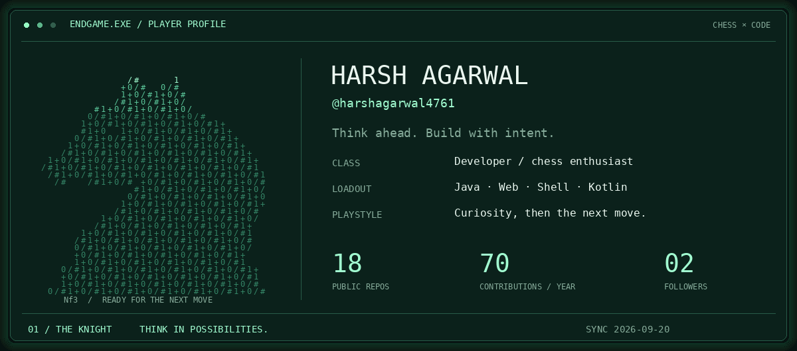
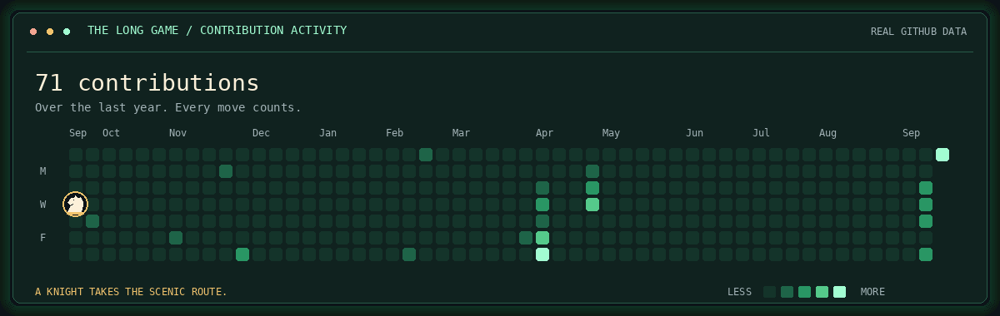
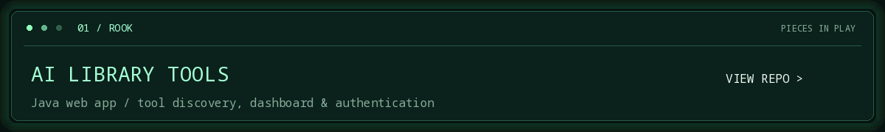
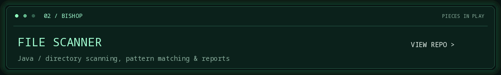
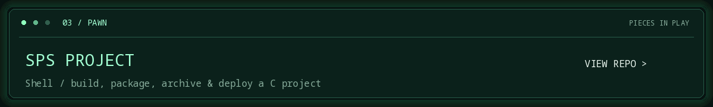

  <b>♞ THINK AHEAD. BUILD WITH INTENT.</b> 
  Code, curiosity, and the next good move.

  <a href="https://github.com/harshagarwal4761?tab=repositories">Repositories</a>
  &nbsp; / &nbsp;
  <a href="#-pieces-in-play">Projects</a>
  &nbsp; / &nbsp;
  <a href="assets/player-card.png">Still version</a>

### ♞ The long game

Real contributions. A knight taking the scenic route. <a href="assets/contribution-board.png">View without animation</a>.

### ♜ Pieces in play

<b>♟ Open the toolbox</b>

 

Languages and tools used across my projects:

`Java` · `HTML` · `CSS` · `JavaScript` · `Shell` · `Kotlin` · `Git`

- [AI Library Tools](https://github.com/harshagarwal4761/AI-Library-Tools)
- [File Scanner](https://github.com/harshagarwal4761/File-Scanner)
- [SPS Project](https://github.com/harshagarwal4761/SPS-Project)

♚ One move at a time.

<!-- Cards refresh daily using the repository's GitHub Actions workflow. -->
