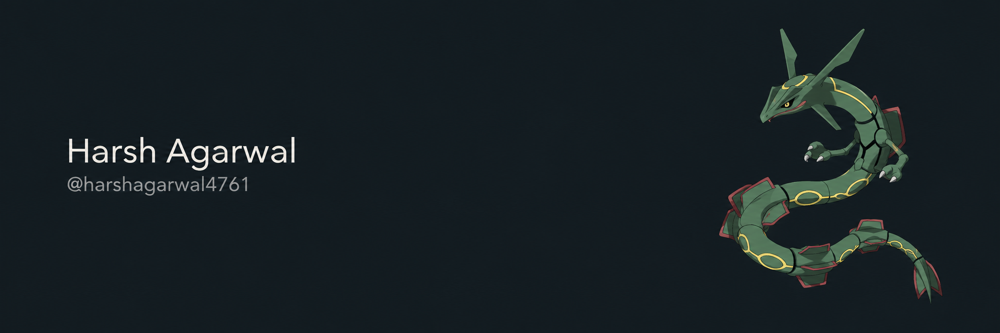

 

I like building useful things and learning as I go.

**Working with** Java, HTML, CSS, JavaScript, Shell, Kotlin, and Git.

### Selected projects

- **[AI Library Tools](https://github.com/harshagarwal4761/AI-Library-Tools)** — A Java web app with tool management, a dashboard, and authentication.
- **[File Scanner](https://github.com/harshagarwal4761/File-Scanner)** — Directory scanning, pattern matching, and reporting in Java.
- **[SPS Project](https://github.com/harshagarwal4761/SPS-Project)** — Shell scripts for building, packaging, and deployment.

[View all repositories →](https://github.com/harshagarwal4761?tab=repositories)

 
A little Rayquaza, a lot of curiosity.
