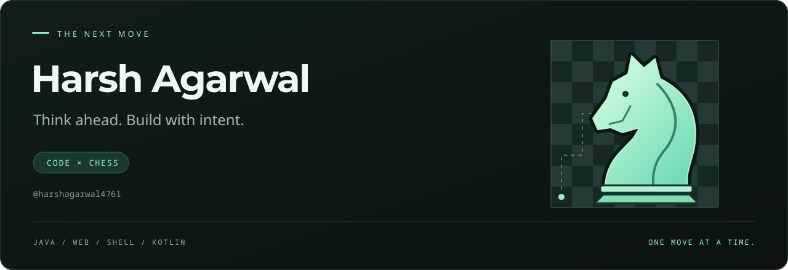

  

  <b>A little strategy. A lot of curiosity. One move at a time.</b> 
  Exploring code, building projects, and enjoying the game of chess.

  <a href="https://github.com/harshagarwal4761?tab=repositories">Explore my repositories</a>
  &nbsp; · &nbsp;
  <a href="#-on-the-board">Featured projects</a>

---

### ♞ On the board

| Piece | Project | Inside the repo |
| :---: | :--- | :--- |
| ♜ | **[AI Library Tools](https://github.com/harshagarwal4761/AI-Library-Tools)** | A Java-based AI tools hub with a web dashboard, authentication, and tool management. |
| ♝ | **[File Scanner](https://github.com/harshagarwal4761/File-Scanner)** | A Java project with directory scanning, pattern matching, and infection reporting components. |
| ♟ | **[SPS Project](https://github.com/harshagarwal4761/SPS-Project)** | Shell scripts for building, packaging, archiving, and deploying a C project. |

### ♟ Pieces in play

Languages and tools found across my projects:

`Java` &nbsp; `HTML` &nbsp; `CSS` &nbsp; `JavaScript` &nbsp; `Shell` &nbsp; `Kotlin` &nbsp; `Git`

<b>♚ Away from the editor</b>

 

Chess belongs here too. Patterns, possibilities, and that satisfying moment when a plan comes together.

---

  ♞ Think a few moves ahead. Keep building.

