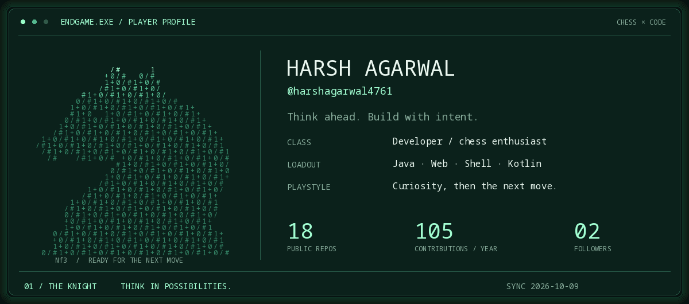
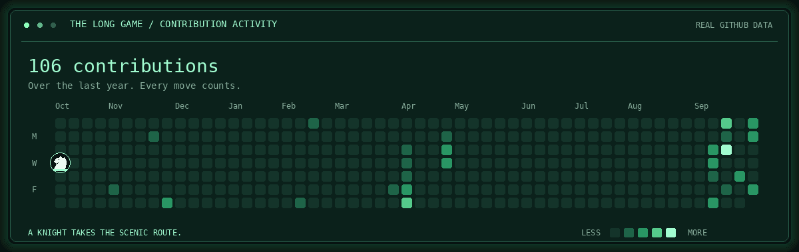

  

  <a href="https://github.com/harshagarwal4761?tab=repositories">Repositories</a>
  &nbsp; · &nbsp;
  <a href="#selected-work">Selected work</a>
  &nbsp; · &nbsp;
  <a href="assets/player-card.png">Still version</a>

 

### The long game

  

A little progress, every day. &nbsp; <a href="assets/contribution-board.png">View without animation ↗</a>

 

## Selected work

<!-- PROJECTS:START -->

<h3>01 / <a href="https://github.com/harshagarwal4761/AI-Library-Tools">AI Library Tools</a></h3>

A Java web app for discovering AI tools, with a dashboard and authentication. CSS &nbsp; · &nbsp; <a href="https://github.com/harshagarwal4761/AI-Library-Tools">Explore repository ↗</a>

<h3>02 / <a href="https://github.com/harshagarwal4761/File-Scanner">File Scanner</a></h3>

Java utilities for directory scanning, pattern matching, and reporting. Java &nbsp; · &nbsp; <a href="https://github.com/harshagarwal4761/File-Scanner">Explore repository ↗</a>

<h3>03 / <a href="https://github.com/harshagarwal4761/SPS-Project">SPS Project</a></h3>

Shell scripts to build, package, archive, and deploy a C project. Shell &nbsp; · &nbsp; <a href="https://github.com/harshagarwal4761/SPS-Project">Explore repository ↗</a>

<!-- PROJECTS:END -->

 

### The toolkit

`Java` &nbsp; `HTML` &nbsp; `CSS` &nbsp; `JavaScript` &nbsp; `Shell` &nbsp; `Kotlin` &nbsp; `Git`

 

♞ &nbsp; Think in possibilities. Build one move at a time.

